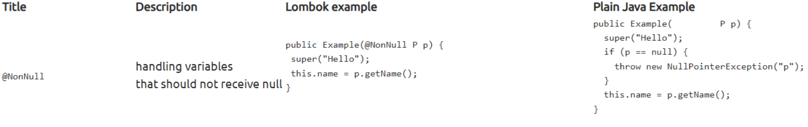
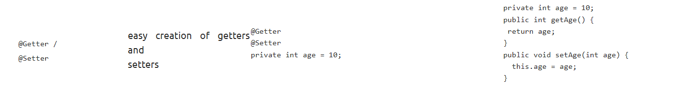
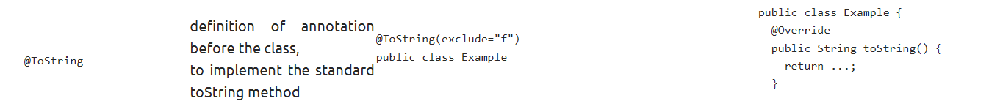
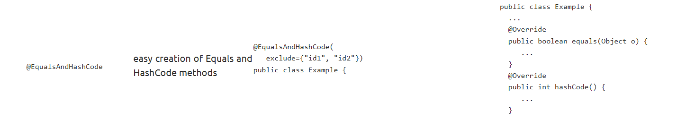
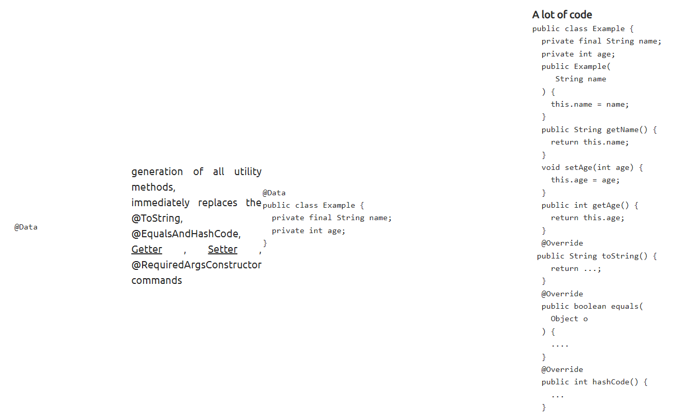
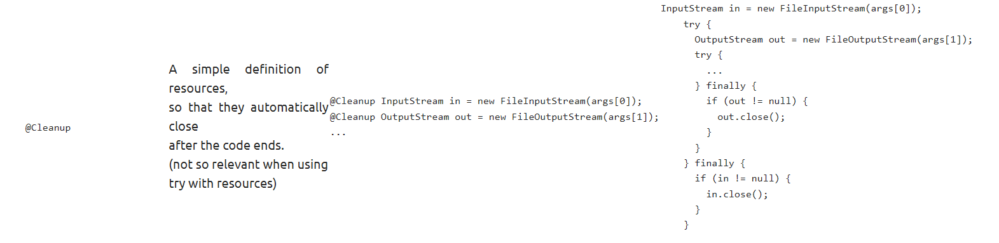

# Lombok-Magic

Learn the enchanting powers of Lombok 🧙‍♂️ to streamline your Java code.

## 1-Introduction

Lombok is a project to add additional functionality to Java by changing the source code before Java compilation.

## 2-Annotations

### 2-1- @NonNull



### 2-2- @Getter /@Setter



### 2-3- @ToString



The exclude="f" part specifies that the toString() method should exclude the field named "f" from its generated string representation. In other words, when the toString() method is invoked on an instance of the Example class, the value of the field "f" will not be included in the resulting string.

### 2-4- @EqualsAndHashCode



### 2-5- @NoArgsConstructor, @RequiredArgsConstructor, @AllArgsConstructor

### 2-5-1- @NoArgsConstructor

With :

```
import lombok.NoArgsConstructor;

@NoArgsConstructor
public class ExampleWithNoArgsConstructor {
    private String field1;
    private int field2;

    // Getters and setters

    @Override
    public String toString() {
        return "ExampleWithNoArgsConstructor{" +
                "field1='" + field1 + '\'' +
                ", field2=" + field2 +
                '}';
    }
}
```

Without :

```
public class ExampleWithoutNoArgsConstructor {
    private String field1;
    private int field2;

    public ExampleWithoutNoArgsConstructor(String field1, int field2) {
        this.field1 = field1;
        this.field2 = field2;
    }

    // Getters and setters

    @Override
    public String toString() {
        return "ExampleWithoutNoArgsConstructor{" +
                "field1='" + field1 + '\'' +
                ", field2=" + field2 +
                '}';
    }
}
```

### 2-5-2- @RequiredArgsConstructor

This annotation generates a constructor for a class that initializes the final fields and/or fields marked with the @NonNull annotation. It only generates a constructor for the fields that are not initialized explicitly.

With :

```
import lombok.RequiredArgsConstructor;

@RequiredArgsConstructor
public class Example {
    private final String name;
    private final int age;
    private final boolean active;

    // Getters and other methods...
}
```

Without :

```
public class Example {
    private final String name;
    private final int age;
    private final boolean active;

    public Example(String name, int age, boolean active) {
        this.name = name;
        this.age = age;
        this.active = active;
    }

    // Getters and other methods...
}
```

### 2-5-3- @AllArgsConstructor

Without :

```
public class Example {
    private int id;
    private String name;

    public Example(int id, String name) {
        this.id = id;
        this.name = name;
    }

    // Getters and setters

    @Override
    public String toString() {
        return "Example [id=" + id + ", name=" + name + "]";
    }
}
```

with :

```
import lombok.AllArgsConstructor;

@AllArgsConstructor
public class Example {
    private int id;
    private String name;

    // Getters and setters

    @Override
    public String toString() {
        return "Example [id=" + id + ", name=" + name + "]";
    }
}
```

### 2-6- @Data



### 2-7- @Value

With :

```
import lombok.Value;

@Value
public class Person {
    private final String name;
    private final int age;
    private final String address;
}
```

Without :

```
public class Person {
    private final String name;
    private final int age;
    private final String address;

    public Person(String name, int age, String address) {
        this.name = name;
        this.age = age;
        this.address = address;
    }

    public String getName() {
        return name;
    }

    public int getAge() {
        return age;
    }

    public String getAddress() {
        return address;
    }

    @Override
    public boolean equals(Object obj) {
        if (this == obj) {
            return true;
        }
        if (obj == null || getClass() != obj.getClass()) {
            return false;
        }
        Person person = (Person) obj;
        return age == person.age &&
                name.equals(person.name) &&
                address.equals(person.address);
    }

    @Override
    public int hashCode() {
        return Objects.hash(name, age, address);
    }

    @Override
    public String toString() {
        return "Person{" +
                "name='" + name + '\'' +
                ", age=" + age +
                ", address='" + address + '\'' +
                '}';
    }
}
```

- Immutability:

  - @Value : generates an immutable class. Once an instance is created, its state cannot be modified.
  - @Data : generates a mutable class. It provides getters and setters for all fields, allowing modification of the object's state.

- Additional functionality:

  - @Data : includes additional features such as @NoArgsConstructor, @RequiredArgsConstructor, and @AllArgsConstructor to generate constructors with different parameter configurations.
  - @Value : does not include these additional constructor generation options.

### 2-8- @Builder

Without the @Builder annotation:

```
public class Person {
    private String firstName;
    private String lastName;
    private int age;

    public Person(String firstName, String lastName, int age) {
        this.firstName = firstName;
        this.lastName = lastName;
        this.age = age;
    }

    // Getters and setters omitted for brevity

    @Override
    public String toString() {
        return "Person{" +
                "firstName='" + firstName + '\'' +
                ", lastName='" + lastName + '\'' +
                ", age=" + age +
                '}';
    }
}

```

In the code above, we have a Person class with a constructor, private fields, and manually implemented toString() method.

Now, let's see the same class with the @Builder annotation:

```
import lombok.Builder;

@Builder
public class Person {
    private String firstName;
    private String lastName;
    private int age;

    // Getters and setters are automatically generated by Lombok

    @Override
    public String toString() {
        return "Person{" +
                "firstName='" + firstName + '\'' +
                ", lastName='" + lastName + '\'' +
                ", age=" + age +
                '}';
    }
}
```

By adding the @Builder annotation from Lombok, we eliminate the need for a manual constructor and getters/setters. Lombok generates a builder pattern, allowing us to create instances of the Person class with a fluent API. The generated builder provides methods to set values for each field, and we can invoke the **build()** method to obtain an instance of the Person class.

### 2-8-1- @Builder+@Singular

```
import lombok.Builder;
import lombok.Singular;

import java.util.List;

@Builder
public class Person {
    private String firstName;
    private String lastName;
    private int age;

    @Singular
    private List<String> hobbies;

    // Getters and setters are automatically generated by Lombok

    @Override
    public String toString() {
        return "Person{" +
                "firstName='" + firstName + '\'' +
                ", lastName='" + lastName + '\'' +
                ", age=" + age +
                ", hobbies=" + hobbies +
                '}';
    }
}
```

When using the @Singular annotation with the @Builder annotation, Lombok generates additional methods to add elements to the collection. In this case, it generates a hobby(String hobby) method that allows adding a single hobby at a time.

Here's an example usage:

```
Person person = Person.builder()
        .firstName("John")
        .lastName("Doe")
        .age(30)
        .hobby("Reading")
        .hobby("Gardening")
        .build();
```

### 2-9- @SneakyThrows

With :

```
import lombok.SneakyThrows;

public class Example {
    @SneakyThrows
    //Or : @SneakyThrows(YourException.class)
    public void doSomething() {
        // Code that may throw a checked exception
    }
}
```

Without :

```
public class Example {
    public void doSomething() {
        try {
            // Code that may throw a checked exception
        } catch (Exception e) {
            // Handle the exception
        }
    }
}
```

### 2-10- @Log / @Slf4j / @Log4j

With :

```
import lombok.extern.java.Log;

@Log
public class Example {
    public void doSomething() {
        log.info("Doing something");
    }
}
```

Without :

```
public class Example {
    private static final java.util.logging.Logger log = java.util.logging.Logger.getLogger(Example.class.getName());

    public void doSomething() {
        log.info("Doing something");
    }
}
```

### 2-11- @Cleanup


